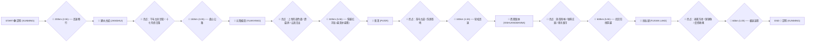

```mermaid
graph LR
    A["START 🟢 昆明 (KUNMING)"] --> B{"🚗 200km (2.5h) ── 高速畅行"}
    B --> C["📍 建水古城 (JIANSHUI)"]
    C --> C1{"🌟 亮点：千年古井豆腐 / 十七孔桥日落"}
    C1 --> D{"🚗 150km (3.0h) ── 盘山公路"}
    D --> E["📍 元阳梯田 (YUANYANG)"]
    E --> E1{"🌟 亮点：上帝的调色盘 / 蘑菇房 / 云海日出"}
    E1 --> F{"🚗 320km (5.5h) ── 穿越红河谷 (最美亦最累)"}
    F --> G["📍 普洱 (PU'ER)"]
    G --> G1{"🌟 亮点：茶马古道 / 洗肺圣地"}
    G1 --> H{"🚗 100km (1.5h) ── 轻松高速"}
    H --> I["📍 西双版纳 (XISHUANGBANNA)"]
    I --> I1{"🌟 亮点：热带雨林 / 咖啡庄园 / 星光夜市"}
    I1 --> J{"🚗 500km (5.5h) ── 北回归线穿越"}
    J --> K["📍 抚仙湖 (FUXIAN LAKE)"]
    K --> K1{"🌟 亮点：琉璃万顷 / 铜锅鱼 / 度假收尾"}
    K1 --> L{"🚗 60km (1.0h) ── 极速返程"}
    L --> M["END 🏁 昆明 (KUNMING)"]

```